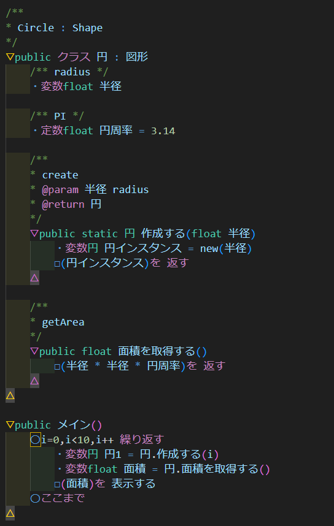

# remind-vscode-extension
Re:MindのVSCode拡張（非公式）/VScode extension for Re:Mind language (unofficial)

# 概要/About
日本語プログラミング仕様記述言語 `Re:Mind` の**非公式**VSCode拡張です。
対応している文法は[2023 Lv1.1ドラフト](https://qiita.com/mylifewithviolin/items/ee1a16a363aaa4fe3f4c)に準拠しています。

This is an **unofficial** VSCode extension for Japanese programming language `Re:Mind`.
It supports the syntax defined in [2023 Lv1.1 draft (Japanese)](https://qiita.com/mylifewithviolin/items/ee1a16a363aaa4fe3f4c).

